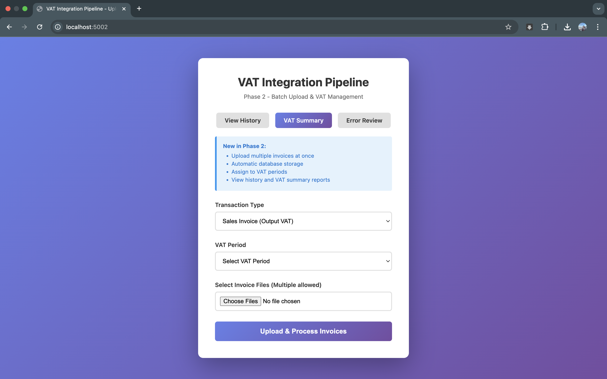
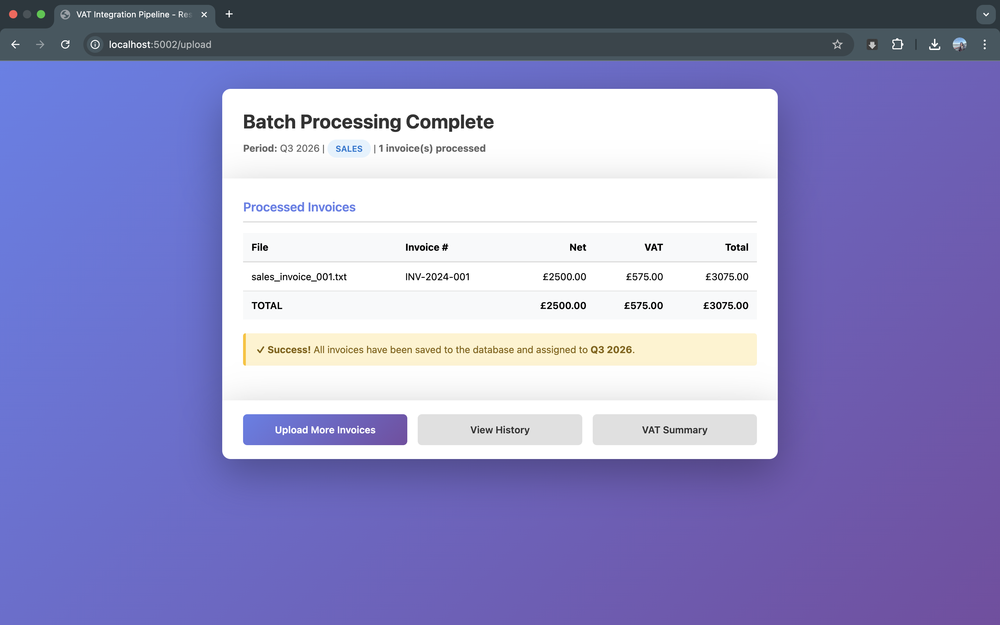
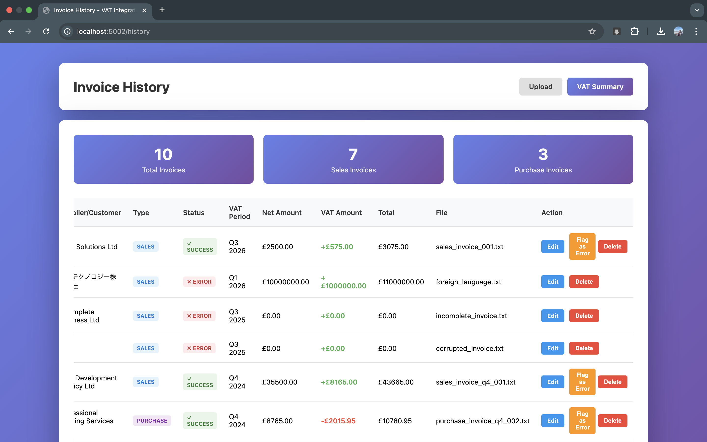
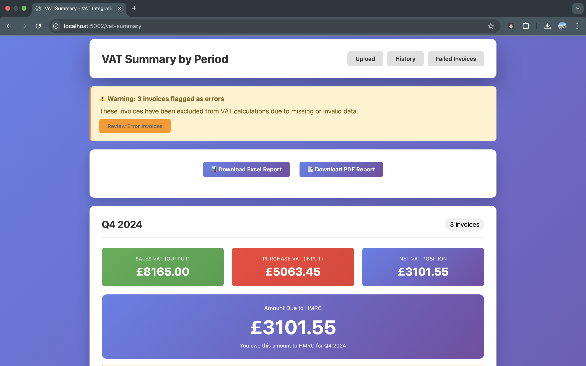
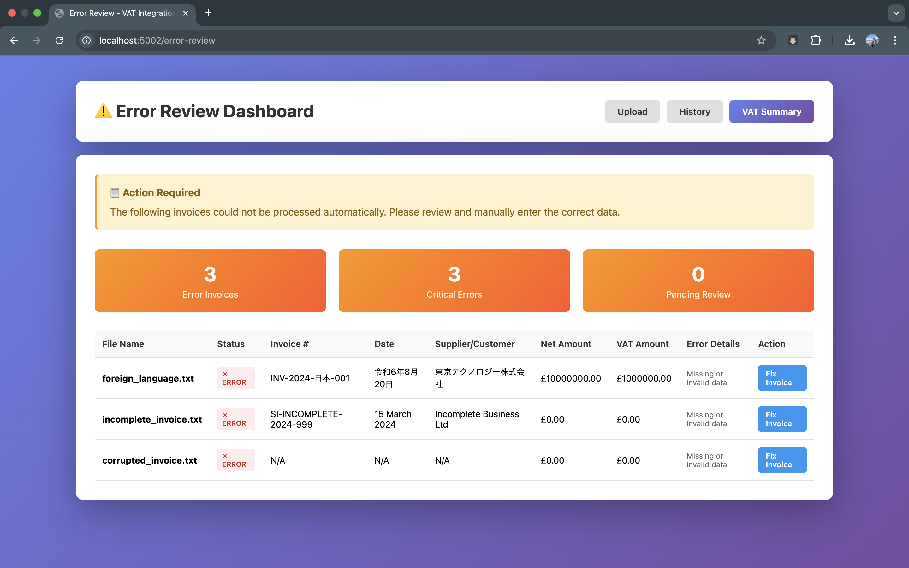
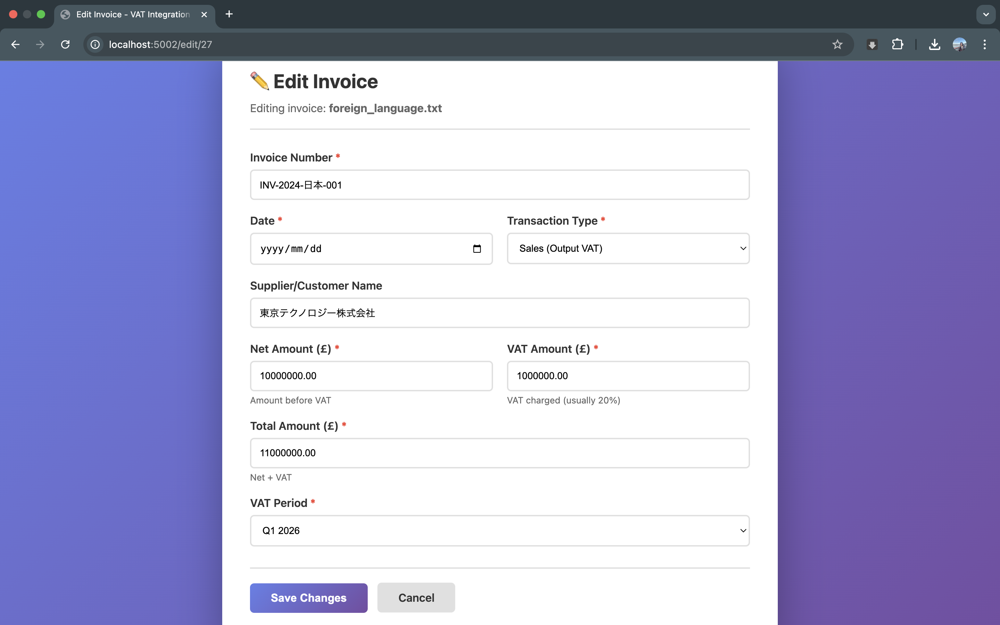
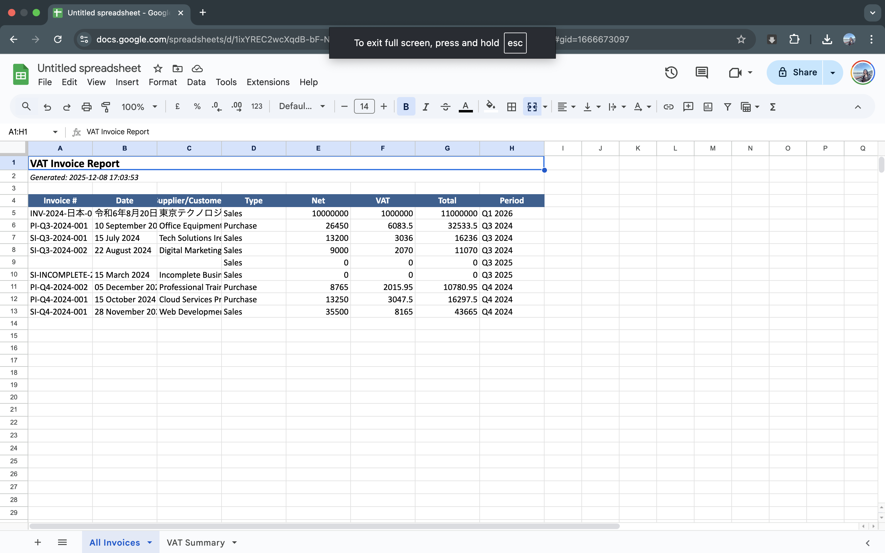

# VAT Integration Pipeline

## Overview
The VAT (Value Added Tax) Integration Pipeline provides automated VAT calculation, validation, data processing, batch uploads, period management, and comprehensive reporting for businesses handling multi-country VAT compliance.

**Current Version**: Phase 3
- ✅ Phase 1: Core VAT calculation and batch processing
- ✅ Phase 2: Database, REST API, VAT period management, invoice history
- ✅ Phase 3: Web UI, error handling, manual data entry, Excel/PDF reports

## Quick Start

### Phase 3 (Current)
```bash
# Install dependencies
pip install -r requirements.txt
pip install -r requirements-phase2.txt
pip install -r requirements-phase3.txt

# Setup database and sample data
python scripts/setup_phase2.py

# Start API server
python -m uvicorn src.api.main:app --reload

# Access Web UI at http://localhost:8000/ui/dashboard
# Access API docs at http://localhost:8000/docs
```

See **[Phase 2 Documentation](docs/PHASE2.md)** for complete API reference.

### Phase 1 (CLI Mode)
```bash
python -m src.pipeline.runner --input data/input/sample_transactions.csv --output data/output/
```

## Phase 3 Features (NEW)
- **Web User Interface**: Modern web dashboard for managing invoices and VAT periods
- **Error Dashboard**: View and manage failed invoice extractions
- **Manual Data Entry**: Web form for manual invoice entry with document preview
- **Excel Reports**: Generate detailed Excel reports with summaries and breakdowns
- **PDF Reports**: Professional PDF reports with invoice details and VAT summaries
- **Report Types**: Period-based, date range, country-specific, and all-invoices reports
- **Responsive Design**: Clean, professional interface with easy navigation

## Phase 2 Features
- **Batch Upload API**: Upload CSV/JSON/Excel files via REST API
- **VAT Period Management**: Create, track, close, and submit quarterly/monthly periods
- **Invoice History**: Store all invoices in database with full search and filtering
- **REST API**: Full-featured API with auto-generated documentation
- **Advanced Filtering**: Filter by country, date range, amount, category, VAT period
- **Reporting**: Period summaries with breakdowns by country and category

## Phase 1 Features
- VAT rate configuration by country and region
- Transaction data ingestion and validation
- VAT calculation engine
- Data transformation and formatting
- Error handling and logging
- Output generation for downstream systems

## Screenshots

### 1. Batch Invoice Upload
*Upload multiple invoices with VAT period selection*



### 2. Extraction Results
*AI-powered invoice data extraction with VAT calculations*



### 3. Invoice History with Error Flagging
*View all invoices with status indicators (Success/Error)*



### 4. VAT Summary by Period
*Net VAT position grouped by quarterly periods*



### 5. Error Dashboard
*Review and manually correct failed extractions*



### 6. Manual Entry Form
*Edit invoice data with validation*



### 7. Excel Report Download
*Professional Excel reports with multiple sheets*



## Project Structure
```
pipeline-integration/
├── config/                 # Configuration files
│   ├── vat_rates.json     # VAT rates by country
│   └── pipeline.yaml      # Pipeline configuration
├── src/                   # Source code
│   ├── api/              # REST API (Phase 2+3)
│   │   └── main.py       # FastAPI application with web UI
│   ├── core/             # Core modules
│   │   ├── calculator.py # VAT calculation logic
│   │   ├── validator.py  # Data validation
│   │   └── transformer.py # Data transformation
│   ├── database/         # Database layer (Phase 2)
│   │   ├── models.py     # SQLAlchemy models
│   │   ├── repositories.py # Data repositories
│   │   └── connection.py # DB connection manager
│   ├── ingestion/        # Data ingestion
│   │   ├── reader.py     # Data readers
│   │   └── parser.py     # Data parsers
│   ├── pipeline/         # Pipeline orchestration
│   │   └── runner.py     # Main pipeline runner
│   ├── services/         # Business logic (Phase 2+3)
│   │   ├── batch_upload_service.py # Batch processing
│   │   ├── vat_period_service.py   # VAT period management
│   │   └── report_service.py       # Report generation (Phase 3)
│   └── utils/            # Utilities
│       ├── logger.py     # Logging utilities
│       └── exceptions.py # Custom exceptions
├── templates/            # Web UI templates (Phase 3)
│   ├── base.html        # Base template
│   ├── dashboard.html   # Dashboard page
│   ├── error_dashboard.html # Error handling page
│   ├── manual_entry.html    # Manual data entry
│   └── reports.html     # Report generation page
├── tests/                # Unit tests
├── data/                 # Data directories
│   ├── input/           # Input data
│   └── output/          # Output data
├── docs/                # Documentation
├── scripts/             # Setup scripts
│   └── setup_phase2.py # Database setup
├── requirements.txt     # Python dependencies
├── requirements-phase2.txt # Phase 2 dependencies
└── requirements-phase3.txt # Phase 3 dependencies
```

## Installation

### Prerequisites
- Python 3.8+
- pip

### Setup
```bash
# Install dependencies
pip install -r requirements.txt
```

## Configuration

### VAT Rates Configuration
Edit `config/vat_rates.json` to configure VAT rates by country.

### Pipeline Configuration
Edit `config/pipeline.yaml` to configure pipeline behavior.

## Usage

### Running the Pipeline
```bash
python -m src.pipeline.runner --input data/input/transactions.csv --output data/output/
```

### Command Line Options
- `--input`: Input file path
- `--output`: Output directory path
- `--config`: Custom configuration file
- `--log-level`: Logging level (DEBUG, INFO, WARNING, ERROR)

## Data Format

### Input Format
CSV file with the following columns:
- `transaction_id`: Unique transaction identifier
- `amount`: Transaction amount (excluding VAT)
- `country_code`: ISO country code
- `transaction_date`: Date of transaction (YYYY-MM-DD)
- `category`: Product/service category

### Output Format
CSV file with calculated VAT:
- All input columns
- `vat_rate`: Applied VAT rate (percentage)
- `vat_amount`: Calculated VAT amount
- `total_amount`: Total amount including VAT
- `validation_status`: Validation result

## Development

### Running Tests
```bash
pytest tests/
```

### Code Style
This project follows PEP 8 style guidelines.

## Web UI Usage (Phase 3)

### Dashboard
Access the main dashboard at `http://localhost:8000/ui/dashboard` to view:
- Total invoices and VAT amounts
- Failed extraction count
- Recent invoices
- VAT periods overview

### Error Dashboard
View failed invoice extractions at `http://localhost:8000/ui/errors`:
- See all invoices with validation errors
- Click "Fix Now" to manually enter correct data
- Track pending reviews and resolved issues

### Manual Data Entry
Enter invoices manually at `http://localhost:8000/ui/manual-entry`:
- View scanned documents (PDF or images)
- Fill in missing or incorrect fields
- Automatic VAT calculation
- Auto-assignment to VAT periods

### Generate Reports
Create downloadable reports at `http://localhost:8000/ui/reports`:
- **VAT Period Reports**: Reports for specific quarters or months
- **Date Range Reports**: Custom date range analysis
- **Country Breakdown**: VAT summary by country
- **All Invoices**: Complete export of all invoices
- Available formats: Excel (.xlsx) and PDF

## Future Roadmap
- Integration with external VAT validation services (VIES)
- Real-time processing capabilities with webhooks
- OCR integration for automatic invoice scanning
- Multi-currency support with exchange rates
- Email notifications for period closures
- Advanced analytics and forecasting

## License
MIT License

## Contact
For questions or issues, please open a GitHub issue.
